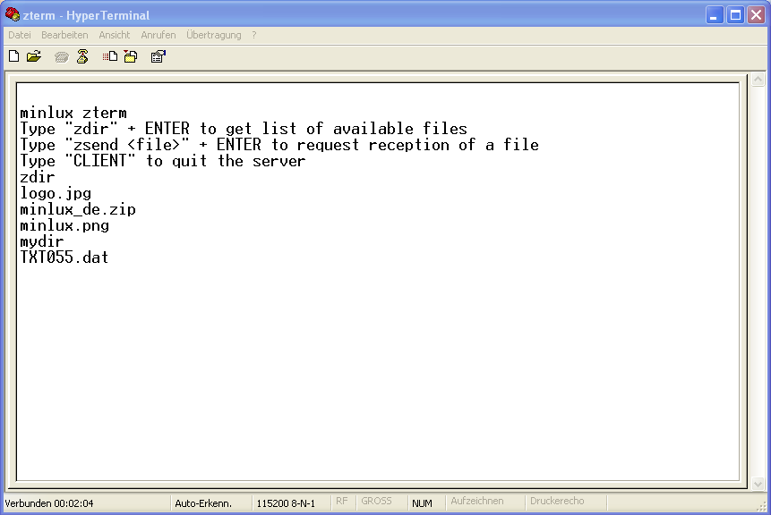

# zterm

Linux base *serial terminal server* used to provide a simple way to transfer files to any kind of client, using zmodem protocol.

# Mac / RaSCSI user note

This is a fork of minlux/zterm with the hard coded baud rate and device name changed. It's intended to work on my Mac SE, and has been tested, but it's VERY slow. Also I have not gotten this going with reduced privileges, so it runs as ROOT, which is REALLY NOT SAFE. I hope to fix that.

This requires ser2net to bind socat tty to a network port. * Currently, recreating the symlink pointing zmodem_socket to /dev/ttyUSB0 and then running ./zterm will make a null modem compatible version. This works with a USB to serial, and macintosh to db9 null modem serial cable.

For network access (default) This fork binds to a symlink at /home/pi/zmodem_socket, which is directed to the pty created by socat. that pty is virtually connected to the other pty, symlinked to as /home/pi/ser2net_socket.
 
It has been tested on RaSCSI, using something like the following:

```
# Installing:

sudo apt-get install ser2net lrzsz cmake socat
cd /home/pi
git clone https://github.com/Alex-Kw/zterm


# Using:
sudo socat -d -d pty,raw,link=/home/pi/zmodem_socket,echo=0 pty,raw,link=/home/pi/ser2net_socket,echo=0 &
# (EDIT SER2NET CONFIG) - **NEED TO ADD TO GIT** - enable 19200 baud / port 3001 by editing the default config /etc/ser2net.yaml (disable the other connections and correct the serial tty to /home/pi/ser2net_socket on the enabled connection).
ser2net
cd /home/pi/zterm/build
mkdir /home/pi/zterm_public
ln -s /home/pi/zterm_public zdata
# Place any files you need in /home/pi/zterm_public/
sudo ./zterm
```

Once that is running, use any serial application (I use an app completely unrelated to this project called zterm on my classic Mac). With a null modem the connection is basically established, but in my case for network access, I use a WiModem232 and "ATDT 192.168.1.15:3001" to connect from the classic macs terminal to the serial Zmodem server running on the RaSCSI.


## Usecase
Imagine you are on a computer or an embedded device and you need to get files from a linux machine. However you don't have any network or data drive to get these files. The only interface which is available is a serial (RS232, UART) interface. Then *zterm* may be for you!

*zterm* is a little tool that is intended to run on the linux machine. It receives commands from the remote computer via RS232 to
- send a list of files ("served" by the server)
- and initiate a *zmodem* file transfer ("up" to the remote)

On the remote site (the client) you only need a terminal program that "understands" the *zmodem protocol*. On Windows *Hyper Terminal* is such a program.



With the command `zdir` + *ENTER* client can request a list of files on the server.\
With the command `zsend <file>` + *ENTER* the client can instruct the server to send the requested file.


## Build
The build process of *zterm* is based on cmake:
```
cd build
cmake ..
make
```

## Usage
### Server
Before you can use *zterm* you have to provide a "link" to the data served by *zterm*. *zterm* expects a folder `zdata` next to its executable containing the data. Using a symbolic link is the recommended solution. E.g.:
```
cd build
ln -s ~/Downloads zdata
```

Currently *zterm* is hard coded to use `/home/pi/zmodem_socket`. Its operates on *19200bps 8N1*. To start it you just has to call
```
./zterm
```
from the `build` directory.

### Client
On the client side you can use whatever terminal program you want. You just has to connect to the serial interface with *19200bps 8N1*. Then you enter
- `zdir` + *ENTER* to get a file list
- `zsend <file>` + *ENTER* to request the file transfer. (then, on Windows *Hyper Terminal* for example, a popup window will appear and "receive" the file automatically)

Normally the server runs in an "endless loop". However, if the client wants to stop the server it just has to type `CLIENT`. Then the server will terminate and no further interaction is possible.


## Internals
The actuall file listing is based on the invocation of a shell script *zdir* which must be located parallel to the *zterm* binary. The actuall file transfer is based on the invocation of a shell script *zsend* which must be located parallel to the *zterm* binary. Both must be executable!

The shell script *zsend* gets the requested file as first argument. It looks for that file in an subfolder `zdata`. *zsend* itself is using the linux command line tool *sz* for the transfer (which is part of the lszrz package, https://ohse.de/uwe/software/lrzsz.html). Possibly you need to install that package first:
```
sudo apt-get install lrzsz
```

Why is that "strange" command *CLIENT* to quit the server? To make long story short: I used to use *zterm* in a script which started first *zterm* and afterwards *pppd*. *pppd* allows to establish a *direct cable connection* [DCC](https://en.wikipedia.org/wiki/Direct_cable_connection) between a windows computer and the linux machine. Windows initiates a *DDC* connection, by sending the command *CLIENT* a few times in advance. *zterm* is using this a trigger to terminate so that the following *pppd* can be started...
